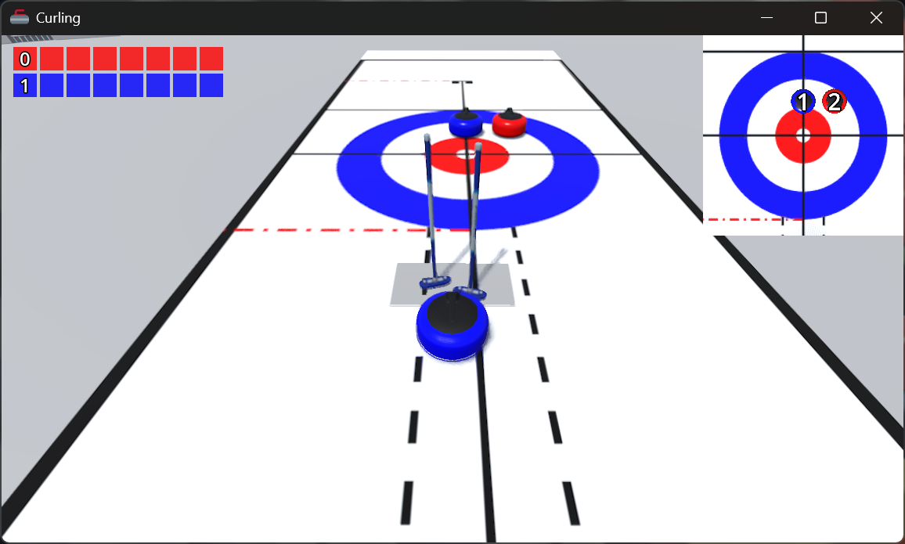

# Curling

## Screenshots

## Assets

### Models

- [Curling Stone SVG Vector](https://www.svgrepo.com/svg/405166/curling-stone)
    - **Author**: Twitter.
    - **License**: MIT License.
- [Curling Cartoon Tiger and Ball](https://sketchfab.com/3d-models/curling-cartoon-tiger-and-ball-382f4534a1c24b4dacd011378a2a6359)
    - **Author**: ADMA200.
    - **License**: CC Attribution.
- [CurlingBroom V1](https://free3d.com/3d-model/curlingbroom-v1--872352.html)
    - **Author**: printable_models.
    - **License**: Personal Use License.
- [Rome: Gladiator Arena](https://sketchfab.com/3d-models/rome-gladiator-arena-554186cb26634d5fb48f11b0d9b518d6)
    - **Author**: Jody_Hong.
    - **License**: CC Attribution.

### Textures

- [Curlingsheet flip](https://commons.wikimedia.org/wiki/File:Curlingsheet_flip.svg)
    - **Author**: Antonsusi.
    - **License**: GFDL.

### Sounds

- [Interface Sounds](https://kenney.nl/assets/interface-sounds)
    - **Author**: Kenney.
    - **License**: CC0.
- [Impact Sounds](https://kenney.nl/assets/impact-sounds)
    - **Author**: Kenney.
    - **License**: CC0.
- [Curling Stone Slides Down Ice](https://freesfx.co.uk/Category/Curling/158)
    - **Author**: freesfx.co.uk
    - **License**: [Custom](https://freesfx.co.uk/Page/4/End-User-License-Agreement)
- [Single Sweep](https://freesfx.co.uk/sfx/broom-sweep)
    - **Author**: freesfx.co.uk
    - **License**: [Custom](https://freesfx.co.uk/Page/4/End-User-License-Agreement)
- [Eclipse – lo-fi tape emulated music, mildly confusing vibe with dreamy synths](https://www.zapsplat.com/sound-effect-category/royalty-free-music/)
    - **Author**: Kulluh.
    - **License**: Royalty Free.
- [Exoplanet Dawn – lo-fi tape emulated music, dreamy](https://www.zapsplat.com/sound-effect-category/royalty-free-music/)
    - **Author**: Kulluh.
    - **License**: Royalty Free.

### Godot Addons

- [Lines & Trails 3D](https://github.com/CozyCubeGames/cozy-cube-godot-addons)
    - **Author**: CozyCubeGames.
    - **License**: MIT License.
